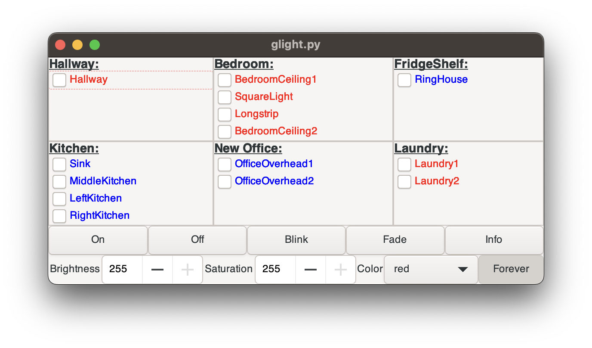

# light

---

_Library for interacting with Phillis Hue Lights_

## light.py

_Library for interacting with the lights_


## glight.py

_GTK interface for interacting with the lights using PyGTK._


### Note

You must have two environmental variables set:

```LIGHT_UNIT``` -The IP address on the local network of the Bridge

```LIGHT_USER``` - The API key from the Hue develoer console